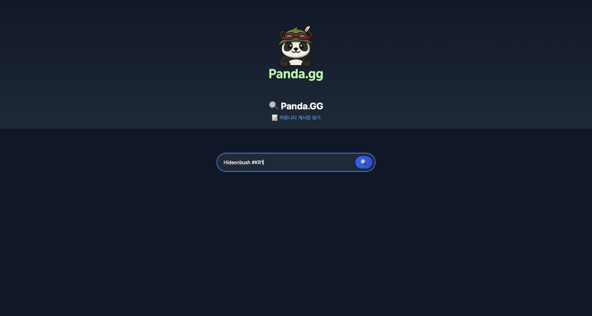
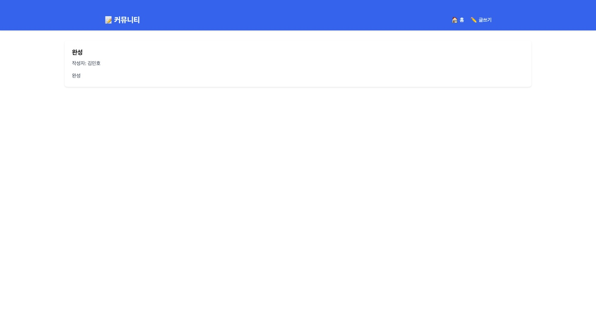
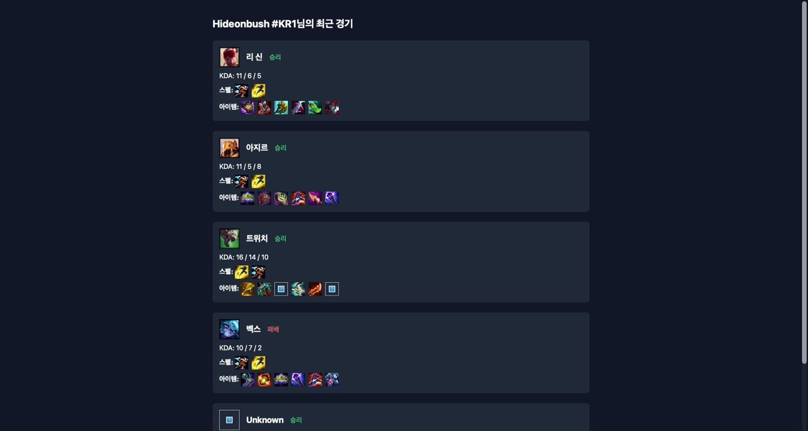
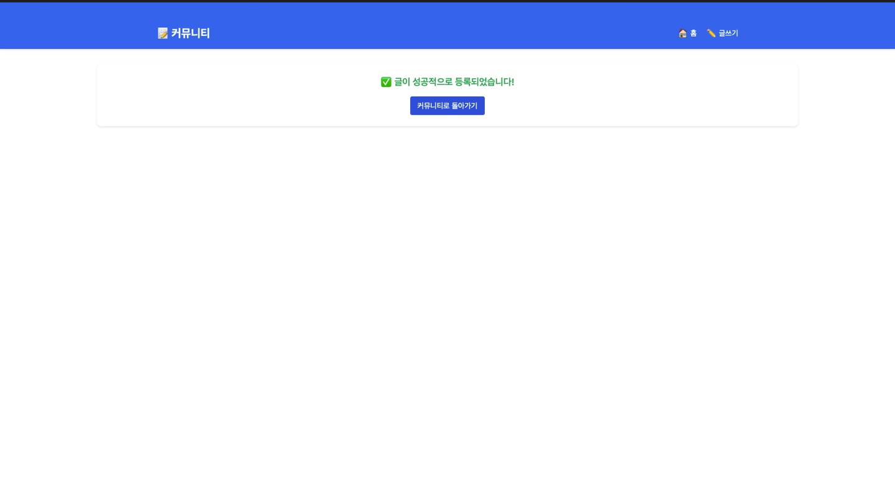
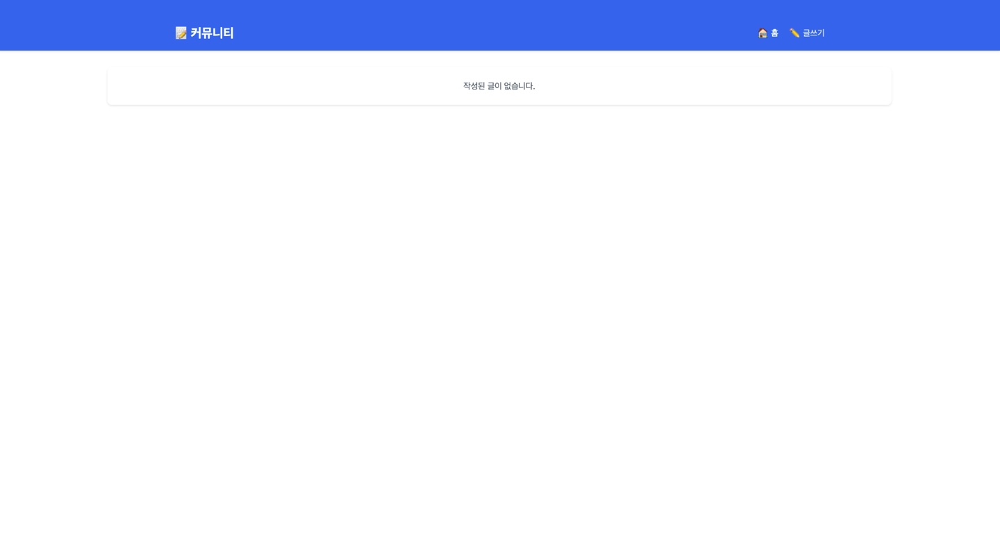

# Panda.gg 🎮

**Panda.gg**는 League of Legends(롤) 전적을 검색할 수 있는 웹사이트입니다.  
[Riot Games API](https://developer.riotgames.com/)를 활용하여 소환사의 최근 게임 정보와 기본 통계를 조회할 수 있습니다.

---

## 📸 데모 스크린샷

### 메인 화면


### 전적 검색 화면


### 전적 히스토리


### 글 작성 성공 화면


### 커뮤니티 화면


---

## 🚀 주요 기능

- 소환사 이름으로 검색
- 최근 전적 정보 출력
- 챔피언, 킬/데스/어시(KDA), 승/패 여부 표시
- Riot API 연동
- Flask로 구현된 간단한 백엔드 서버

---

## 🛠️ 기술 스택

- Python 3.x
- Flask
- Riot Games API
- HTML/CSS (Jinja 템플릿)

---

## 👥 팀원 (Contributors)

| 역할       | 소속                 | 이름   | GitHub 프로필 |
|------------|----------------------|--------|---------------|
| 프론트엔드 | 서경대 소프트웨어학과 | 이승훈 | [@ehaahaa](https://github.com/ehaahaa) |
| 백엔드     | 서경대 컴퓨터공학과   | 김민호 | [@minho0805](https://github.com/minho0805) |
## ⚙️ 실행 방법

### 1. 클론

```bash
git clone https://github.com/minho0805/Panda.gg.git
cd Panda.gg
